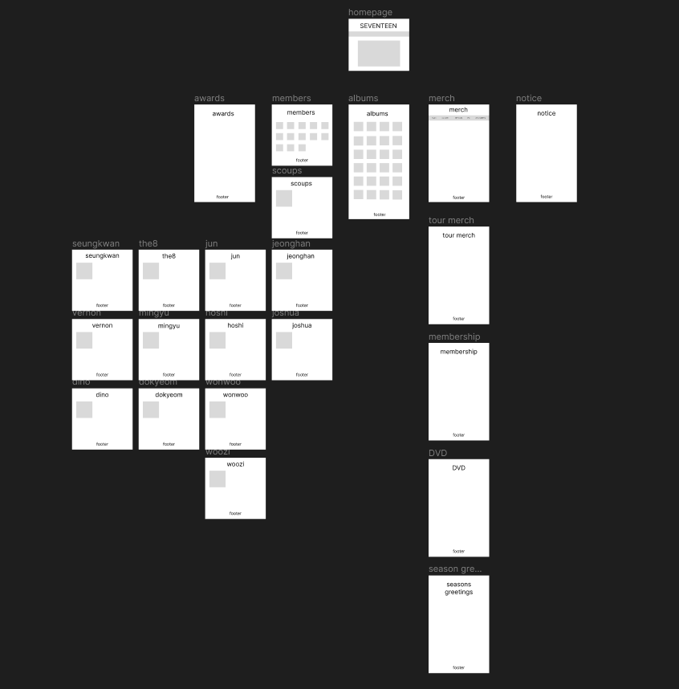

rayann foo 
IT04
S10257860H 

user audience 
1. fans of the kpop group seventeen as known as carats 
2. people who want to know more about the group 
3. people who want to purchase merchanise of the group 

purpose 
1. promote the kpop group seventeen 
2. allow users to learn more about the band's history and members
3. give fans real time update about the group's activities 
4. sell more of their merchandise 

this website is catered to all who wants to get to more about the band and those who wish to purchase merchandise of the band such as tour apparels , albums etc. it also allows users to learn more about the band's history such as their pre-debut story and the awards they won as well as their latest activities such as tours etc. 

the webiste's main colour scheme would be pastel colours, mainly rose quartz(13-1520) and serenity (15-3919).

wireframe 
https://www.figma.com/file/1T8KRdWhgVDxZxk5xJvi6n/fed-assignment-1-wireframe?type=design&node-id=0%3A1&mode=design&t=wyN3c7Qzz5r6fGeL-1 
